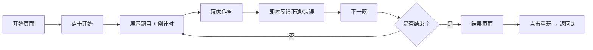

# 抢答游戏产品需求文档 (PRD)

## 1. 产品概述
一款快节奏的知识抢答游戏，支持多个知识领域题目，包含倒计时抢答、积分排名和即时反馈等核心玩法。
- 主要功能：知识题目展示、倒计时抢答、计分系统、游戏结果展示
- 目标用户：希望通过游戏化方式学习/测试知识的用户

## 2. 核心功能

### 2.1 用户角色
| 角色 | 注册方式 | 核心权限 |
|------|---------|---------|
| 玩家 | 无需注册 | 开始游戏、作答、查看结果 |

### 2.2 功能模块
1. **开始页面**：游戏介绍、开始按钮、难度选择
2. **游戏页面**：题目展示、选项按钮、倒计时、得分显示
3. **结果页面**：最终得分、正确率、答题详情、重玩按钮

### 2.3 页面详情
| 页面名称 | 模块名称 | 功能描述 |
|---------|---------|---------|
| 开始页面 | 游戏入口 | 展示游戏名称、玩法说明、"开始"按钮 |
| 游戏页面 | 答题核心 | 显示题目、4个选项按钮、10秒倒计时、当前题目序号与得分 |
| 结果页面 | 成绩汇总 | 显示总分、正确率、每题答题详情、"再玩一次"按钮 |

## 3. 核心流程
玩家进入 → 点击开始 → 逐题作答（每题10秒限时） → 选择选项后即时反馈（正确/错误） → 进入下一题 → 全部作答完毕展示结果 → 可选择重玩

## 4. 用户界面设计

### 4.1 设计风格
- **主色调**：深紫/靛蓝渐变背景 + 荧光青/粉色霓虹强调色（赛博朋克风格）
- **按钮风格**：圆角胶囊按钮，带发光悬停效果
- **字体**：主标题使用大气的显示字体，正文使用现代无衬线字体
- **布局**：居中卡片式布局，大面积留白
- **图标风格**：使用 emoji 点缀（🏆、⏱️、✨、🔥）

### 4.2 页面设计概述
| 页面名称 | 模块名称 | UI 元素 |
|---------|---------|---------|
| 开始页面 | Hero 区域 | 大标题、副标题说明、发光"开始游戏"按钮、背景动画 |
| 游戏页面 | 答题区 | 题目卡片、4个大选项按钮、顶部倒计时进度条、右上角得分 |
| 结果页面 | 成绩展示 | 大号得分、正确率环形图、答题列表（正确/错误标记）、重玩按钮 |

### 4.3 响应性
- Desktop 优先，移动端自适应
- 选项按钮在移动端垂直排列，桌面端 2x2 网格
- 触摸区域最小 48px

### 4.4 动效
- 页面切换：淡入淡出 + 轻微缩放
- 倒计时：数字颜色从绿→黄→红渐变
- 答题反馈：正确选项绿色放大闪烁，错误选项红色抖动
- 背景：轻微移动的渐变光斑
