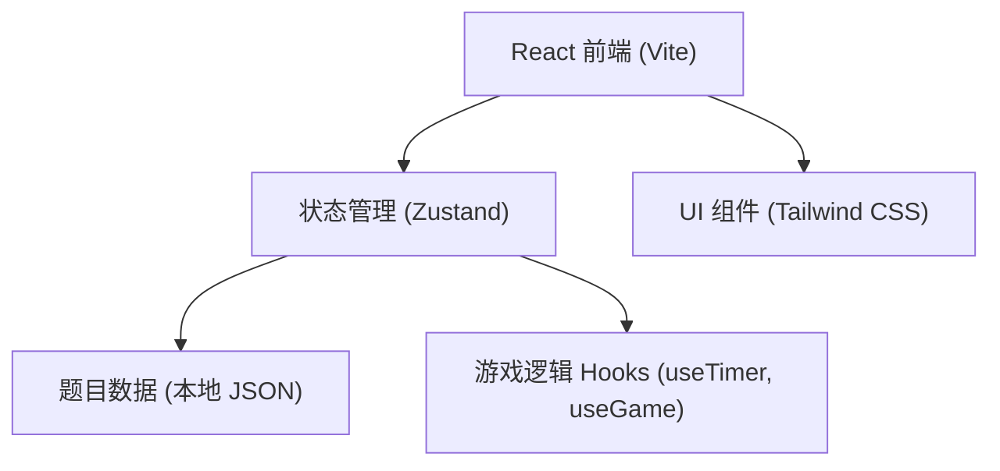

# 抢答游戏技术架构文档

## 1. 架构设计


## 2. 技术描述
- **前端**：React 18 + TypeScript + Tailwind CSS 3 + Vite
- **初始化工具**：vite-init
- **后端**：无（纯前端应用，题目数据本地保存）
- **状态管理**：Zustand
- **路由**：无需多路由，单页应用通过状态切换页面

## 3. 目录结构

```
src/
├── data/
│   └── questions.ts       # 题库数据
├── store/
│   └── gameStore.ts       # Zustand 游戏状态
├── pages/
│   ├── StartPage.tsx      # 开始页面
│   ├── GamePage.tsx       # 游戏页面
│   └── ResultPage.tsx     # 结果页面
├── components/
│   ├── Timer.tsx          # 倒计时组件
│   ├── QuestionCard.tsx   # 题目卡片
│   ├── OptionButton.tsx   # 选项按钮
│   └── ProgressBar.tsx    # 进度条
├── App.tsx                # 根组件（页面切换）
├── main.tsx               # 入口
└── index.css              # Tailwind 样式 + 自定义动画
```

## 4. 数据模型

### Question 题目
```typescript
interface Question {
  id: number;
  question: string;
  options: string[];  // 长度为 4
  correctIndex: number; // 0-3
  category: string;
}
```

### GameState 游戏状态
```typescript
interface GameState {
  page: 'start' | 'game' | 'result';
  currentIndex: number;       // 当前题目序号
  score: number;              // 当前得分
  answers: AnswerRecord[];    // 每题作答记录
  questions: Question[];      // 本次题目（随机抽取）
}

interface AnswerRecord {
  questionId: number;
  selectedIndex: number | null;  // null 表示超时
  correct: boolean;
  timeUsed: number;  // 秒
}
```

## 5. 核心逻辑
- **游戏开始**：从题库随机抽取 10 题，重置分数，进入第一题
- **倒计时**：每题 10 秒，使用 `setInterval` 倒计时，归零自动进入下一题（判为错误）
- **作答**：点击选项后，立即判题，显示正确/错误，暂停计时，1.5 秒后进入下一题
- **计分规则**：答对 +10 分，额外剩余时间奖励（每剩 1 秒 +1 分）
- **结束**：10 题结束后展示结果页
